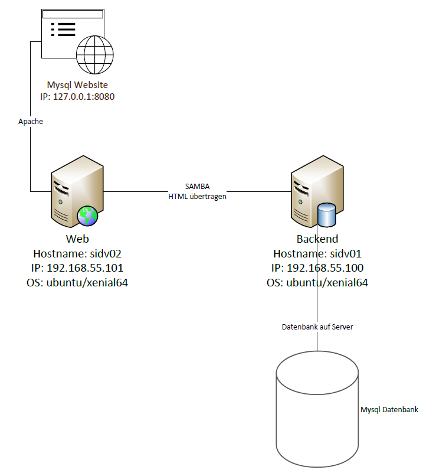
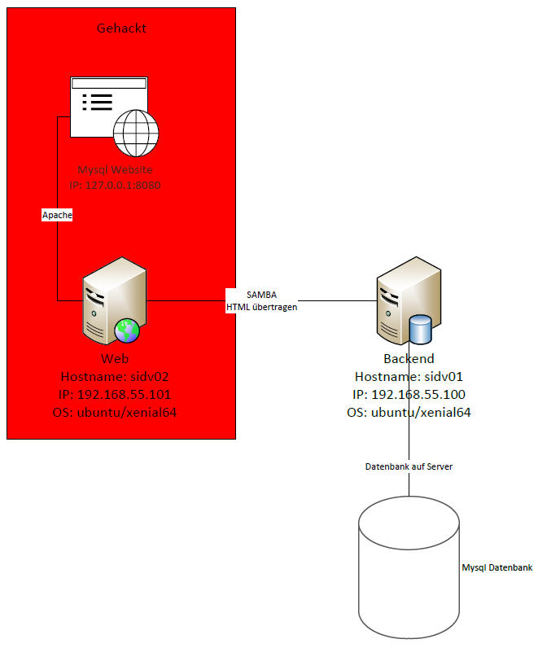

# Mysql server mit Vagrant und Virtualbox

## Inhaltsverzeichniss

1. [Einleitung](#einleitung)
2. [Grafische Übersicht des Service](#grafische-übersicht-des-service)
3. [Projekt](#projekt)  
    3.1. [MySQL installation](#mysql-installation)  
    3.2 [Samba installation](#samba-installation)  
    3.3 [Apache installation](#apache-installation)
4. [Anwenden / Testen](#anwenden--testen)  
   4.1 [Anwendungsbeispiel](#anwendungsbeispiel)  
   4.2 [Testprotokoll](#testprotokoll)
5. [Quellenverzeichniss](#quellenverzeichniss)

## [Einleitung](#einleitung)
Vagrant ist eine freie Ruby-Anwendung zum Erstellen und Verwalten virtueller Maschinen Vagrant ermöglicht einfache Softwareverteilung insbesondere in der Software- und Webentwicklung und dient als Wrapper zwischen Virtualisierungssoftware wie VirtualBox, KVM/QEMU, VMware und Hyper-V und Software-Configuration-Management-Anwendungen beziehungsweise Systemkonfigurationswerkzeugen wie Chef, Saltstack und Puppet.
  
Wir werden in diesem Projekt Vagrant benutzten um eine Mysql Datenbank zu installieren und diese dann mithilfe von Samba auf einem anderen Client über Apache auf das GUI zugreifen kann.

Die Installation mit Vagrant wurde erfolgreich durchgeführt wenn sie foldendes in ihren Browser eingeben und dann zur PhPmyadminn gelangen:  
`http://127.0.0.1:8080/`  

Passwort für root ist root

## [Grafische Übersicht des Service](#grafische-übersicht-des-service)
 

## [Projekt](#projekt)

### [MySQL installation](#mysql-installation)
MySQL lässt sich mit mit einem Skript installieren, dass wir im Internet gefunden haben:  
https://gist.github.com/sheikhwaqas/9088872#file-setup-mysql-sh-L9

### [Samba installation](#samba-installation)
Mit folgendem Befehl kann man Samba einfach auf Ubuntu vollständig automatisch installieren:  
`sudo apt-get -y install samba`  

Mithilfe von Vagrant Commands kann man dann das Template unter dem Folder Tempaltes auf den Client und den Server anwenden.

### [Apache installation](#apache-installation)
Mit folgendem Befehl kann man auch Apache einfach und voll automatisch installieren:  
`sudo apt-get -y install apache2`  
 
Danach befindet sich die Website unter: `/var/www/html` und kann dort ersetzt werden bei Bedarf.

## [Anwenden / Testen](#anwenden--testen)

### [Anwendungsbeispiel](#anwendungsbeispiel)
Mit dieser Konfiguration kann man sich vor Hacking attacken schützten. Da die Datenbank Website und die Datenbank auf verschiedenen Servern sind kann der atacker nur den Webserver attackieren, nicht aber den Datenbank Server. Somit ist dieser Sicher bei einer Attacke. Falls der Webserver gehackt wird, kann dieser dann auch einfach mittels Vagrant ersetzt werden, ohne das der Datenbank server etwas bemerkt.

### [Testprotokoll](#testprotokoll)

|Bedingung|erfüllt|nicht erfüllt|Begründung|
|--------|--------|--------|--------|
|MySQL Webgui ist erreichbar.||X|Zu wenig Zeit zu viele Leute krank.|
|Datenbanken können bearbeitet werden.|X|||
|Samba Share kommuniziert Ordnungsgemäss.|X|||
|Beide VMs installiert.|X|||
|Apache Website funktioniert.|X|||

## [Quellenverzeichniss](#quellenverzeichniss)

|Thema|Quellen|
|--------|--------|
|    Markdown    |    1. https://www.ionos.de/digitalguide/websites/web-entwicklung/markdown/#:~:text=Mit%20Pipes%20(%7C)%20lassen%20sich,die%20entsprechenden%20Zellen%20mit%20Bindestrichen.&text=Es%20ist%20prinzipiell%20nicht%20wichtig%2C%20dass%20die%20Pipes%20untereinander%20sind.   2. https://programmerwiki.com/article/23911842833/   3. https://www.markdownguide.org/getting-started/   4. https://www.markdownguide.org/basic-syntax/#images-1    |
|    Mysql    |   1. https://www.liquidweb.com/kb/create-a-mysql-database-on-linux-via-command-line/    2. https://gist.github.com/sheikhwaqas/9088872#file-setup-mysql-sh-L9 |